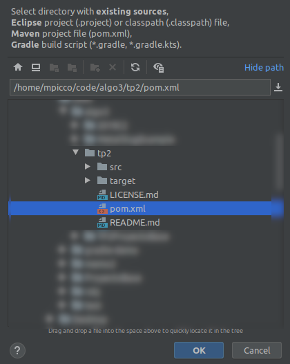
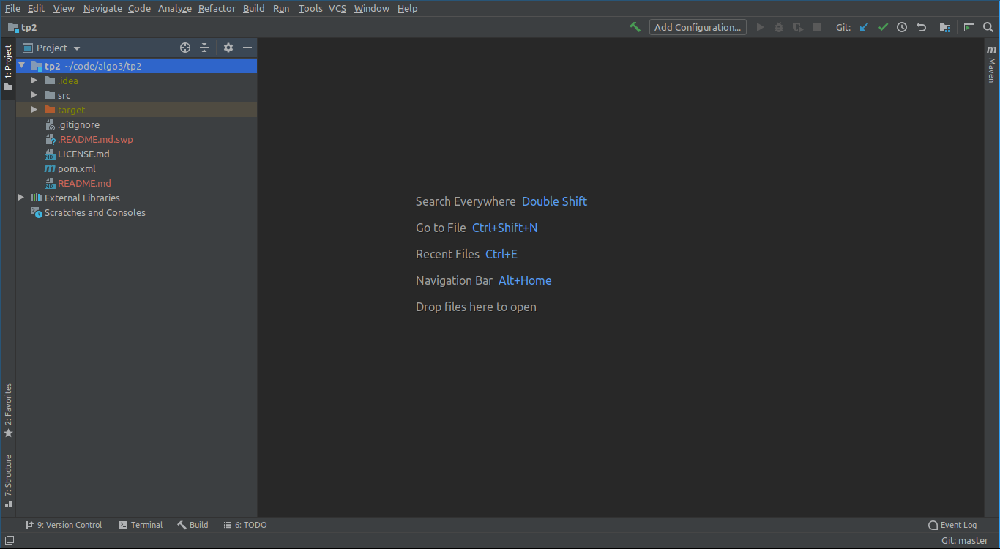
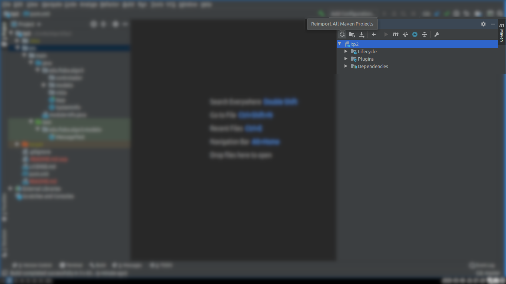
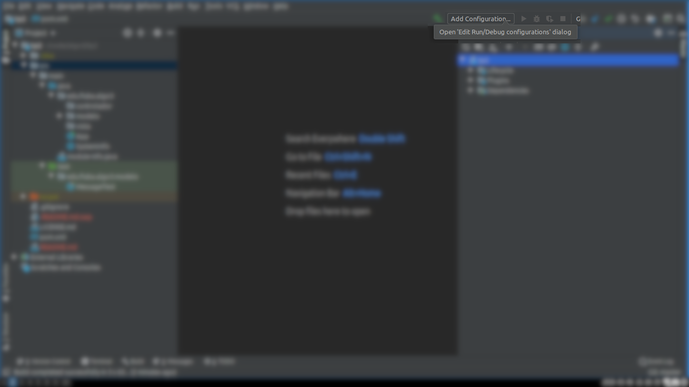
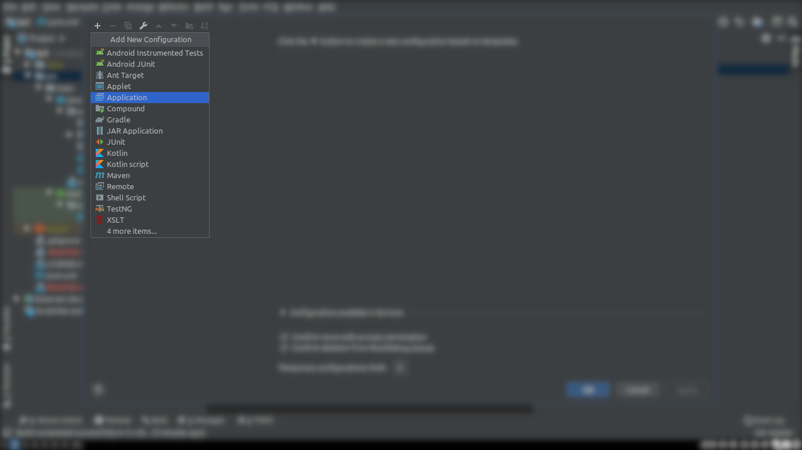
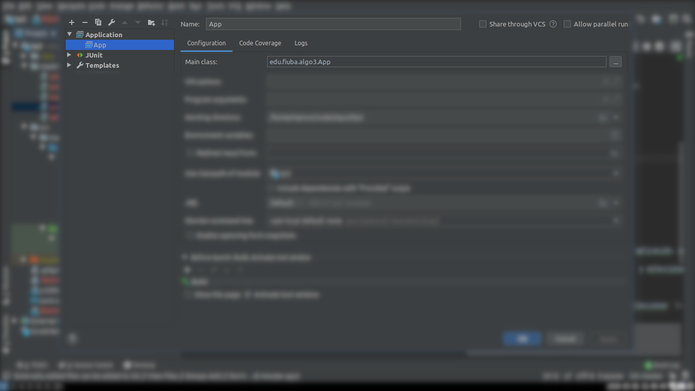
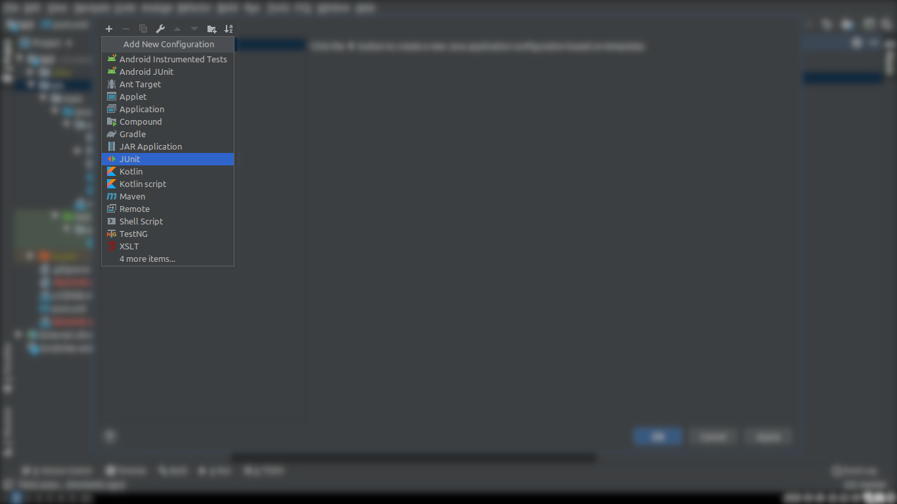
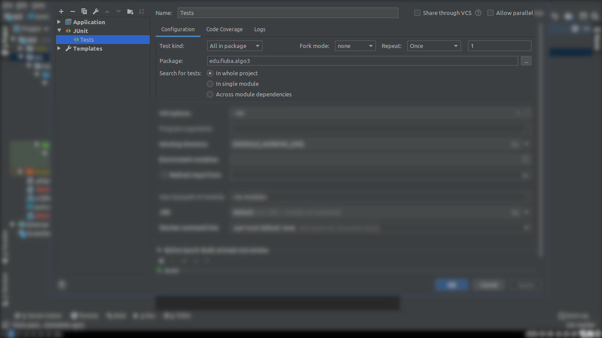
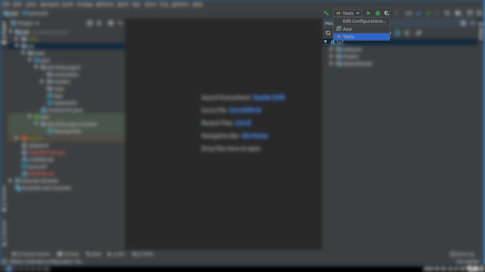
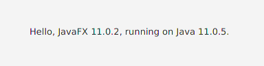

# Proyecto Base TP2 - AyP III

Este repositorio contiene la estructura básica para el TP2 y cuenta con la configuración para resolver las dependencias JavaFX + JUnit + Mockito a través de Maven.

Se recomienda utilizar la versión 11 de Java con este repositorio.

## Instalación

### 1. Checkout del repo

Descargar el repositorio utilizando cualquier cliente de git. Ejemplo via consola:

```shell script
git clone https://github.com/M-Picco/Algo3TP2Base.git tp2
```

El ejemplo anterior debería crear una carpeta `tp2` con los contenidos del repo.

### 2. Subir contenidos a otro repo

1. Crear un repo en github
2. Obtener el link de clonación (ej: https://github.com/M-Picco/Algo3TP2Base.git)
3. Ejecutar los siguientes comandos para reconfigurar el remoto:

```shell script
git remote set-url origin <link-de-clonacion>
```

4. (Opcional) Borrar la carpeta `readme_imgs`, limpiar este README y hacer commit y push

Otra alternativa es:

1. Crear un repo en github
2. Obtener el link de clonación (ej: https://github.com/M-Picco/Algo3TP2Base.git)
3. Clonar el repositorio vacio
4. Copiar los contenidos de este repo al que bajaron (este readme y sus imagenes no es necesario que lo incluyan)
5. Hacer commit y push

### 3. Configuración del entorno

#### 3.1 IntelliJ

1. En la ventana de inicio de IntelliJ seleccionar `Import`

2. Navegar al directorio clonado y seleccionar el archivo `pom.xml`



3. Seleccionar `Next` para saltear los pasos de configuración y abrir el entorno. Deberíamos ver algo como lo siguiente:



4. Abrir el panel lateral de `Maven`

5. Seleccionar `Reimport All Maven Projects` para descargar las dependencias



6. Una vez que Maven haya finalizado con las importaciones. Seleccionar `Add Configuration`



7. Seleccionar el botón `+` ubicado arriba a la izquierda y seleccionar la opción `Application`



8. Renombrar a "App" y rellenar el campo `Main class` con `edu.fiuba.algo3.App` para indicar el punto de entrada de la aplicación. Luego darle a `Ok`



9. Si desean pueden añadir la configuración de JUnit para correr todas las pruebas. Para ello ir de vuelta al botón `+` y seleccionar `JUnit`



10. Renombrar a "Test" y Cambiar `Test kind` a `All in package` y rellenar el campo `Package` con `edu.fiuba.algo3`. Seleccionar `In whole project`. Finalizar dando `Ok`



11. Seleccionar la configuración `Test` y darle Play (con el botón o con el shortcut correspondiente)



12. Luego seleccionar la configuración `App` y darle Play. Debería aparecer una ventana con el texto "Hello, JavaFX 11.0.2, running on Java 11.0.5"



#### 3.2 Linea de comando

Para compilar y correr la última versión de su código, simplemente ubicarse en el mismo directorio que el archivo `pom.xml` e ingresar:

```shell script
mvn clean javafx:run
```

La tarea `clean` se encarga de limpiar lo viejo y compilar la última versión. `javafx:run` ejecuta la aplicación.

Deberían obtener un output parecido al siguiente:

```shell script
(base) mpicco-pc:~/code/algo3/tp2 (master) $ mvn clean javafx:run
[INFO] Scanning for projects...
[INFO] 
[INFO] ------------------------< edu.fiuba.algo3:tp2 >-------------------------
[INFO] Building tp2 1.0-SNAPSHOT
[INFO] --------------------------------[ jar ]---------------------------------
[INFO] 
[INFO] --- maven-clean-plugin:2.5:clean (default-clean) @ tp2 ---
[INFO] Deleting /home/mpicco/code/algo3/tp2/target
[INFO] 
[INFO] --- javafx-maven-plugin:0.0.1:run (default-cli) @ tp2 ---
[INFO] Using 'UTF-8' encoding to copy filtered resources.
[INFO] skip non existing resourceDirectory /home/mpicco/code/algo3/tp2/src/main/resources
[INFO] Changes detected - recompiling the module!
[INFO] Compiling 4 source files to /home/mpicco/code/algo3/tp2/target/classes
```